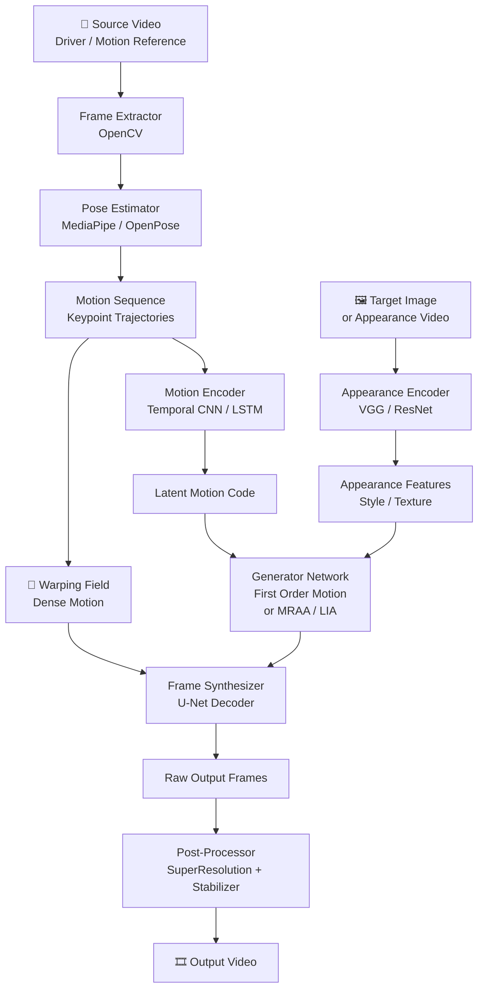

# 🎬 MotionTransfer

AI-powered motion transfer system that extracts motion sequences from a source video and applies them to a target subject — creating compelling animations and video synthesis using pose estimation and generative models.

## 🏗️ Architecture



##  Features

- Keypoint-based motion extraction (body, face, hands)
- First-Order Motion Model and MRAA architecture support
- Temporal smoothing to eliminate jitter
- Super-resolution upscaling of output frames
- Real-time preview mode
- Batch video processing
- CLI and Python API

## 🛠️ Tech Stack

| Layer | Technology |
|-------|-----------|
| Language | Python 3.10+ |
| Deep Learning | PyTorch 2.x |
| Pose Estimation | MediaPipe, OpenPose |
| Motion Model | First Order Motion Model, MRAA |
| Video I/O | OpenCV, FFmpeg |
| Upscaling | Real-ESRGAN |
| GPU | CUDA 11.8+ |
| Visualization | Matplotlib, imageio |

##  How to Run

```bash
# 1. Clone and install
git clone https://github.com/jadfarhat-cell/motiontransfer.git
cd motiontransfer
pip install -r requirements.txt

# 2. Download pretrained checkpoints
python scripts/download_checkpoints.py

# 3. Run motion transfer
python transfer.py \
  --source target_person.jpg \
  --driving source_motion.mp4 \
  --output result.mp4

# 4. With GPU acceleration
python transfer.py --source img.jpg --driving vid.mp4 --output out.mp4 --gpu 0

# 5. Real-time webcam mode
python realtime.py --source target.jpg --output preview

# 6. Batch processing
python batch_transfer.py --input_dir ./inputs/ --output_dir ./outputs/
```

## 📁 Project Structure

```
motiontransfer/
├── transfer.py             # Main transfer script
├── realtime.py             # Real-time webcam demo
├── batch_transfer.py       # Batch processing
├── models/
│   ├── motion_extractor.py # Keypoint detection
│   ├── generator.py        # Frame synthesis
│   ├── discriminator.py    # GAN discriminator
│   └── dense_motion.py     # Warping field estimator
├── checkpoints/            # Pretrained weights
├── scripts/
│   └── download_checkpoints.py
├── requirements.txt
└── configs/
    ├── vox-256.yaml
    └── taichi-256.yaml
```
